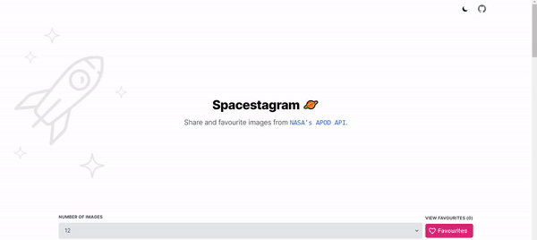

# [Shopify Front End Developer Internship Challenge](https://jteashopifychallenge.netlify.app/)

## Overview

Spacestagram is a React web application designed to pull images from [NASA's APOD API](https://github.com/nasa/apod-api). It allows users to browse through a variety of interesting space photography and favourite the images to view later. 

You can visit the site [here](https://jteashopifychallenge.netlify.app/).

## Table of Contents

- [Tech](#tech)<br/>
- [Developing](#developing)<br/>
- [Technical Decisions](#technical-decisions)<br/>
- [Demos](#demo-gifs)<br/>

## Tech

**Front-End**

- [React](https://reactjs.org/)
- [TailwindCSS](https://tailwindcss.com/)

## Developing

For more details and troubleshooting see:

- [Create-React-App](https://create-react-app.dev/docs/getting-started/)
- [Using TailwindCSS with React](https://tailwindcss.com/docs/guides/create-react-app)

First, install the necessary packages via:

```bash
# install npm packages 
npm i
```

Next, setup a `.env` file and put in the [APOD API](https://github.com/nasa/apod-api) url. You can sign up for an API key [here](https://api.nasa.gov/).

```bash
# api url with key in the query param
REACT_APP_API=url_string
```

Now you can spin up the frontend. Default port is `3000` for a [create-react-app](https://github.com/facebook/create-react-app) project.

```bash
# start react app
npm start
```

## Technical Decisions

**Why is there no database?**

In spirit of the challenge, I decided to use [localStorage](https://developer.mozilla.org/en-US/docs/Web/API/Window/localStorage) to keep things strictly on the front end. When a user favourites an image, it is stored on their browser and is accessible after they refresh the page. If I had to implement persistence via a database, I would opt for [MongoDB](https://www.mongodb.com/) or [PostgreSQL](https://www.postgresql.org/).

**Why isn't there centralized state management?**

Due to the small scope of this project, I decided to not use any centralized state management at all. This decision was made after consulting with this [Redux FAQ](https://redux.js.org/faq/general#when-should-i-use-redux).

## Demo GIFs


